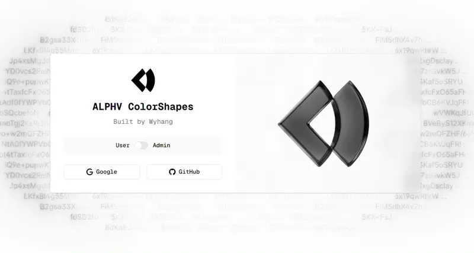
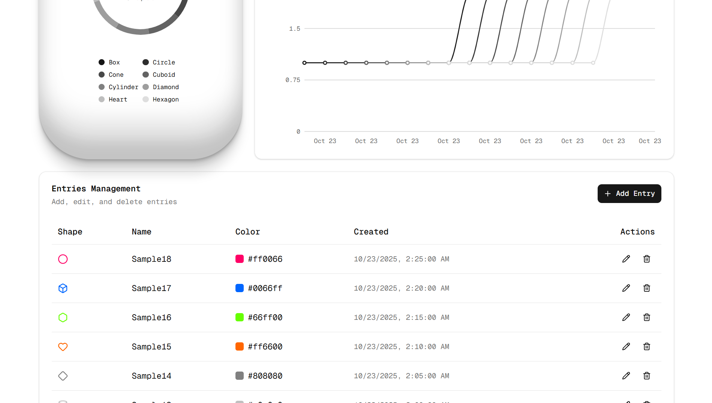
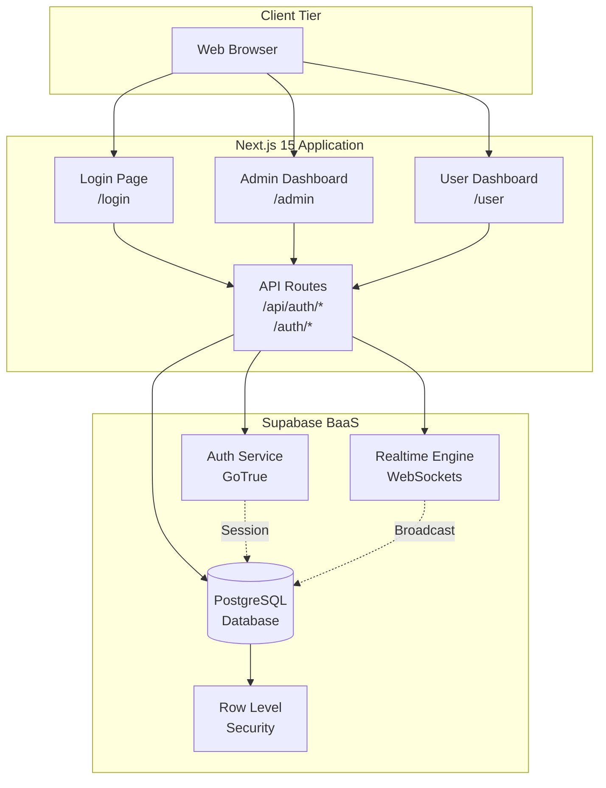

# ALPHV ColorShapes

A modern, full-stack web application for managing colored geometric shapes with role-based access control, real-time updates, and interactive data visualizations.

## Screenshots

### Login Page

*Google and Github OAuth authentication with clean, modern UI*

### Admin Dashboard


*Full CRUD operations with real-time synchronization*

### User Dashboard

*Read-only view with live updates and interactive charts*

---

## Architecture Overview

### System Architecture



### Application Flow


---

## Tech Stack

### Frontend
| Technology | Version | Purpose |
|------------|---------|---------|
| **Next.js** | 15.5.6 | React framework with App Router and Server Components |
| **React** | 19.1.0 | UI library with concurrent features |
| **TypeScript** | 5.x | Type-safe development |
| **Tailwind CSS** | 4.x | Utility-first styling framework |
| **Shadcn/ui** | Latest | Re-usable components built with Radix UI and Tailwind CSS |
| **Radix UI** | Various | Accessible, unstyled component primitives (via Shadcn/ui) |
| **Recharts** | 3.3.0 | Composable charting library for data visualization |
| **Lucide React** | 0.546.0 | Beautiful & consistent icon library |
| **date-fns** | 4.1.0 | Modern JavaScript date utility library |
| **Sonner** | 2.0.7 | Toast notification system |

### Backend & Services
| Technology | Purpose |
|------------|---------|
| **Supabase** | Backend-as-a-Service (PostgreSQL + Auth + Realtime) |
| **PostgreSQL** | Relational database with JSONB support |
| **Supabase Auth** | OAuth 2.0 authentication with multiple providers |
| **Supabase Realtime** | WebSocket-based live data synchronization |

### Developer Tools
- **ESLint** - Code linting and style enforcement
- **PostCSS** - CSS transformations
- **Turbopack** - Fast bundler for development
---

## Database Schema

```sql
-- Users table (managed by Supabase Auth)
auth.users (
  id UUID PRIMARY KEY,
  email TEXT,
  created_at TIMESTAMP
)

-- Profiles table (user metadata)
public.profiles (
  id UUID PRIMARY KEY REFERENCES auth.users(id),
  role TEXT DEFAULT 'user',  -- 'admin' | 'user'
  created_at TIMESTAMP
)

-- Entries table (shape data)
public.entries (
  id UUID PRIMARY KEY DEFAULT gen_random_uuid(),
  name TEXT NOT NULL,
  shape TEXT NOT NULL,      -- 'circle' | 'square' | 'triangle'
  color TEXT NOT NULL,      -- Hex color code
  created_by UUID REFERENCES auth.users(id),
  created_at TIMESTAMP DEFAULT NOW()
)
```

### Row Level Security (RLS) Policies

```sql
-- Profiles: Users can read their own profile
CREATE POLICY "Users can read own profile"
  ON profiles FOR SELECT
  USING (auth.uid() = id);

-- Entries: All authenticated users can read
CREATE POLICY "All users can read entries"
  ON entries FOR SELECT
  TO authenticated
  USING (true);

-- Entries: Only admins can insert/update/delete
CREATE POLICY "Only admins can modify entries"
  ON entries FOR ALL
  TO authenticated
  USING (
    EXISTS (
      SELECT 1 FROM profiles
      WHERE profiles.id = auth.uid()
      AND profiles.role = 'admin'
    )
  );
```

---

## Features

### Authentication & Authorization
- **Google OAuth 2.0** - Secure, passwordless authentication
- **Role-Based Access Control (RBAC)** - Admin vs User permissions
- **Automatic Role Assignment** - Default "user" role on signup
- **Server-Side Auth** - Secure session management with cookies
- **Protected Routes** - Layout-based auth guards

### Data Management
- **CRUD Operations** - Create, Read, Update, Delete entries (Admin only)
- **Real-Time Sync** - Live updates across all connected clients
- **Data Validation** - Type-safe forms with client-side validation
- **Optimistic Updates** - Instant UI feedback
- **Automatic Timestamps** - Server-managed creation dates

### User Interface
- **Responsive Design** - Mobile-first, works on all screen sizes
- **Dark Mode Support** - System preference detection
- **Accessible Components** - ARIA labels, keyboard navigation
- **Loading States** - Skeleton loaders and spinners
- **Empty States** - Helpful messaging for empty data
- **Toast Notifications** - Success/error feedback

### Data Visualization
- **Bar Charts** - Shape distribution by type
- **Timeline Charts** - Entry creation over time
- **Color-Coded Icons** - Visual shape representation
- **Interactive Tables** - Sortable, filterable data views

---

## Project Structure

```
alphv-intern-app/
├── src/
│   ├── app/                      # Next.js App Router
│   │   ├── page.tsx              # Root redirect logic
│   │   ├── layout.tsx            # Root layout with providers
│   │   ├── globals.css           # Global styles
│   │   │
│   │   ├── login/                # Authentication
│   │   │   ├── page.tsx          # Login UI
│   │   │   ├── google-actions.ts # Google OAuth server actions
│   │   │   └── github-actions.ts # GitHub OAuth (future)
│   │   │
│   │   ├── admin/                # Admin dashboard
│   │   │   ├── layout.tsx        # Admin-only guard + header
│   │   │   └── page.tsx          # CRUD operations + realtime
│   │   │
│   │   ├── user/                 # User dashboard
│   │   │   ├── layout.tsx        # User auth guard + header
│   │   │   └── page.tsx          # Read-only view + charts
│   │   │
│   │   ├── auth/callback/        # OAuth callback handler
│   │   │   └── route.ts          # Exchange code for session
│   │   │
│   │   └── api/auth/signout/     # Logout endpoint
│   │       └── route.ts          # Clear session
│   │
│   ├── components/               # React components
│   │   ├── entries-table.tsx     # Reusable data table
│   │   ├── entry-dialog.tsx      # Add/Edit form modal
│   │   ├── shape-icon.tsx        # Dynamic shape renderer
│   │   ├── shapes-chart.tsx      # Bar chart component
│   │   ├── shapes-timeline-chart.tsx  # Timeline chart
│   │   ├── calendar-16.tsx       # Calendar icon
│   │   ├── login-form.tsx        # Login UI component
│   │   │
│   │   └── ui/                   # Shadcn UI components
│   │       ├── button.tsx
│   │       ├── card.tsx
│   │       ├── dialog.tsx
│   │       ├── input.tsx
│   │       ├── label.tsx
│   │       ├── switch.tsx
│   │       ├── calendar.tsx
│   │       ├── chart.tsx
│   │       ├── empty.tsx
│   │       ├── field.tsx
│   │       ├── navigation-menu.tsx
│   │       ├── separator.tsx
│   │       ├── spinner.tsx
│   │       └── sonner.tsx
│   │
│   └── lib/                      # Utilities
│       ├── supabase.ts           # Browser Supabase client
│       ├── supabase-server.ts    # Server Supabase client
│       └── utils.ts              # Helper functions (cn, etc.)
│
├── supabase/
│   ├── config.toml               # Supabase local config
│   ├── seed.sql                  # Database seed script
│   ├── seed-data.sql             # Sample data
│   └── migrations/               # Database migrations
│       ├── 20240101000000_initial_schema.sql
│       └── 20240101000001_add_profile_insert_policy.sql
│
├── public/                       # Static assets
├── docs/                         # Documentation
│   ├── architecture.md           # Architecture details
│   └── screenshots/              # Application screenshots
│
├── .env.local                    # Environment variables (not in git)
├── package.json                  # Dependencies
├── tsconfig.json                 # TypeScript config
├── tailwind.config.js            # Tailwind config
├── next.config.ts                # Next.js config
└── README.md                     # This file
```

---

## Getting Started

### Prerequisites

- **Node.js** 18.17 or later
- **npm** or **yarn** or **pnpm**
- **Supabase CLI** (for local development)
- **Google Cloud Console** account (for OAuth)

### 1. Clone the Repository

```bash
git clone https://github.com/Tanwyhang/alphv-intern-app.git
cd alphv-intern-app
```

### 2. Install Dependencies

```bash
npm install
```

### 3. Set Up Supabase

#### Install Supabase CLI

```bash
npm install -g supabase
```

#### Start Local Supabase

```bash
npx supabase start
```

This will output your local Supabase credentials:
- **API URL**: `http://localhost:54321`
- **Anon Key**: Your local anon key
- **Service Role Key**: Your local service role key

#### Run Migrations

```bash
npx supabase db reset
```

This creates the database schema and seeds initial data.

### 4. Configure Environment Variables

Create a `.env.local` file in the root directory:

```env
# Supabase Configuration
NEXT_PUBLIC_SUPABASE_URL=http://localhost:54321
NEXT_PUBLIC_SUPABASE_ANON_KEY=your-anon-key-here

# Google OAuth (see SETUP.md for detailed instructions)
NEXT_PUBLIC_GOOGLE_CLIENT_ID=your-google-client-id.apps.googleusercontent.com
GOOGLE_CLIENT_SECRET=your-google-client-secret
```

### 5. Set Up Google OAuth

See [`SETUP.md`](./docs/SETUP.md) for detailed Google OAuth configuration instructions.

**Quick steps:**
1. Go to [Google Cloud Console](https://console.cloud.google.com/)
2. Create a new project
3. Enable Google+ API
4. Create OAuth 2.0 credentials
5. Add authorized redirect URI: `http://localhost:54321/auth/v1/callback`
6. Copy Client ID and Secret to `.env.local`
7. Add credentials to Supabase Dashboard

### 6. Start Development Server

```bash
npm run dev
```

Open [http://localhost:3000](http://localhost:3000) in your browser.

### 7. Test the Application

1. **Login** with your Google account
2. You'll be assigned the "user" role by default
3. **Promote to Admin** (in Supabase Studio):
   - Open `http://localhost:54323`
   - Go to Table Editor → `profiles`
   - Find your user and change `role` to `'admin'`
4. **Refresh** the page - you'll be redirected to `/admin`
5. **Test CRUD operations** and real-time updates

---

## Usage Guide

### For Admins

#### Adding an Entry
1. Click **"Add Entry"** button
2. Fill in the form:
   - **Name**: Descriptive name for the shape
   - **Shape**: Choose Circle, Square, or Triangle
   - **Color**: Pick a color (supports hex codes)
3. Click **"Add Entry"** to save

#### Editing an Entry
1. Click the **pencil icon** on any row
2. Modify the fields
3. Click **"Save Changes"**

#### Deleting an Entry
1. Click the **trash icon** on any row
2. Confirm deletion

#### Real-Time Updates
- Changes are instantly reflected across all connected clients
- No need to refresh the page
- Works for all users simultaneously

### For Users

#### Viewing Data
- See all entries in a read-only table
- View shape icons with colors
- See creation timestamps

#### Data Visualizations
- **Shapes Chart**: Bar chart showing shape distribution
- **Timeline Chart**: Entries created over time
- Charts update in real-time as admins add/remove entries

---

## Architecture Deep Dive

### Server Components vs Client Components

```typescript
// Server Component (default in App Router)
// ✅ Can access database directly
// ✅ No JavaScript sent to client
// ✅ Better SEO
export default async function AdminPage() {
  const supabase = await createServerSupabaseClient()
  const { data } = await supabase.from('entries').select('*')
  return <EntriesTable entries={data} />
}

// Client Component (marked with 'use client')
// ✅ Can use hooks (useState, useEffect)
// ✅ Can handle interactivity
// ✅ Can subscribe to realtime updates
'use client'
export function EntriesTable({ entries }) {
  const [data, setData] = useState(entries)
  // ... realtime subscription
}
```

### Authentication Flow

```
1. User clicks "Login with Google"
   ↓
2. Server Action triggers OAuth flow
   ↓
3. User authenticates with Google
   ↓
4. Google redirects to /auth/callback?code=...
   ↓
5. Callback handler exchanges code for session
   ↓
6. Session stored in HTTP-only cookie
   ↓
7. Profile created in database (trigger)
   ↓
8. User redirected based on role
```

### Real-Time Implementation

```typescript
// Subscribe to database changes
const channel = supabase
  .channel('entries-changes')
  .on('postgres_changes', {
    event: '*',  // INSERT, UPDATE, DELETE
    schema: 'public',
    table: 'entries'
  }, (payload) => {
    // Update local state
    if (payload.eventType === 'INSERT') {
      setEntries(prev => [...prev, payload.new])
    }
    // ... handle UPDATE and DELETE
  })
  .subscribe()

// Cleanup on unmount
return () => { channel.unsubscribe() }
```

### Role-Based Access Control

```typescript
// Layout-level protection
export default async function AdminLayout({ children }) {
  const supabase = await createServerSupabaseClient()
  const { data: profile } = await supabase
    .from('profiles')
    .select('role')
    .single()
  
  if (profile?.role !== 'admin') {
    redirect('/user')
  }
  
  return <>{children}</>
}
```

---

## Testing

### Manual Testing Checklist

#### Authentication
- Can login with Google
- Session persists after refresh
- Can logout successfully
- Redirects work correctly based on role

#### Admin Functionality
- Can create new entry
- Can edit existing entry
- Can delete entry
- Changes reflect in real-time
- Toast notifications appear

#### User Functionality
- Can view all entries
- Cannot edit or delete
- Charts display correctly
- Real-time updates work

#### Cross-Browser
- Chrome
- Firefox
- Safari
- Edge

#### Responsive Design
- Desktop (1920x1080)
- Tablet (768x1024)
- Mobile (375x667)

---

## Security

### Implemented Security Measures

1. **Row Level Security (RLS)**
   - Database-level access control
   - Users can only read their own profile
   - Only admins can modify entries

2. **Server-Side Authentication**
   - Sessions stored in HTTP-only cookies
   - No access tokens in localStorage
   - CSRF protection via SameSite cookies

3. **Type Safety**
   - TypeScript prevents runtime errors
   - Database types auto-generated
   - Compile-time validation

4. **Input Validation**
   - Form validation on client and server
   - SQL injection prevention (Supabase handles this)
   - XSS prevention (React escapes by default)

5. **Environment Variables**
   - Secrets stored in `.env.local` (not in git)
   - Different configs for dev/prod
   - Validation of required env vars

---

## Deployment

### Deploy to Vercel (Recommended)

1. **Push to GitHub**
   ```bash
   git push origin main
   ```

2. **Connect to Vercel**
   - Go to [vercel.com](https://vercel.com)
   - Import your repository
   - Vercel auto-detects Next.js

3. **Configure Environment Variables**
   - Add all `.env.local` variables in Vercel dashboard
   - Use production Supabase URL and keys

4. **Update OAuth Redirect**
   - Add production URL to Google OAuth redirect URIs
   - Update Supabase Auth settings

5. **Deploy**
   - Vercel deploys automatically on push
   - Preview deployments for PRs

### Deploy Supabase (Production)

1. **Create Supabase Project**
   - Go to [supabase.com](https://supabase.com)
   - Create new project

2. **Run Migrations**
   ```bash
   supabase db push
   ```

3. **Configure Auth**
   - Enable Google OAuth provider
   - Add production redirect URIs

4. **Update Environment Variables**
   - Use production URL and keys in Vercel

---

## Troubleshooting

### Common Issues

#### "Invalid API Key"
- Check `.env.local` has correct Supabase credentials
- Restart dev server after changing env vars

#### "Not authorized" on admin page
- Check your user role in Supabase Studio
- Change `role` to `'admin'` in `profiles` table

#### Realtime not working
- Ensure Supabase Realtime is enabled
- Check browser console for WebSocket errors
- Verify RLS policies allow reading

#### OAuth redirect fails
- Verify redirect URI matches exactly (with trailing slash)
- Check Google OAuth credentials are correct
- Ensure auth callback route exists

---

## Additional Documentation

- [`SETUP.md`](./docs/SETUP.md) - Detailed setup instructions
- [`IMPLEMENTATION.md`](./docs/IMPLEMENTATION.md) - Implementation notes
- [`shapes.md`](./docs/shapes.md) - Shape specifications
- [`docs/architecture.md`](./docs/architecture.md) - Architecture details

---

## Contributing

### Development Workflow

1. **Create a feature branch**
   ```bash
   git checkout -b feature/your-feature-name
   ```

2. **Make changes**
   - Write clean, documented code
   - Follow existing patterns
   - Add comments for complex logic

3. **Test thoroughly**
   - Manual testing
   - Check all user flows
   - Verify responsive design

4. **Commit with clear messages**
   ```bash
   git commit -m "feat: add user profile page"
   ```

5. **Push and create PR**
   ```bash
   git push origin feature/your-feature-name
   ```

### Code Style

- Use TypeScript for type safety
- Follow ESLint rules
- Use Tailwind for styling
- Keep components small and focused
- Document complex functions

---

## License

This project is created for the ALPHV Intern Assessment.

---

## Contact

For questions or support, please contact Tanwyhang.


**Built with care for ALPHV**

## Chart Color Configuration

Colors defined in `globals.css`:

```css
:root {
  --chart-1: oklch(0.2 0 0);   /* Darkest */
  --chart-2: oklch(0.3 0 0);
  --chart-3: oklch(0.4 0 0);
  --chart-4: oklch(0.5 0 0);
  --chart-5: oklch(0.6 0 0);
  --chart-6: oklch(0.7 0 0);
  --chart-7: oklch(0.8 0 0);
  --chart-8: oklch(0.9 0 0);   /* Lightest */
}
```

## Performance Optimizations

- Server-side rendering for initial page load
- React memoization for chart data
- Efficient real-time subscriptions
- Optimistic UI updates
- Loading states for better UX

## Security Features

- Row-Level Security (RLS) policies
- Server-side authentication checks
- Protected API routes
- Role-based access control
- Secure session management

## Browser Support

- Chrome (latest)
- Firefox (latest)
- Safari (latest)
- Edge (latest)

## Known Limitations

- OAuth requires configured providers in Supabase
- Real-time requires Supabase Realtime enabled
- Seed data requires manual user ID update

## Future Enhancements

- [ ] Email/password authentication UI
- [ ] User profile management
- [ ] Export data to CSV/JSON
- [ ] Advanced filtering and search
- [ ] Bulk operations
- [ ] Activity logs
- [ ] More chart types

## Author

Built by Wyhang for ALPHV
