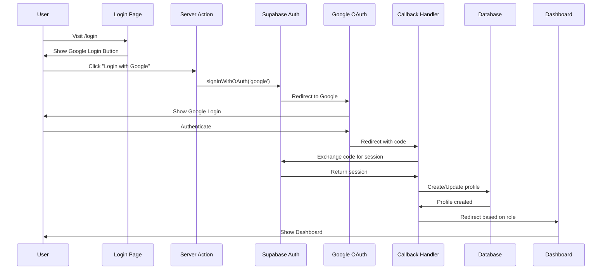
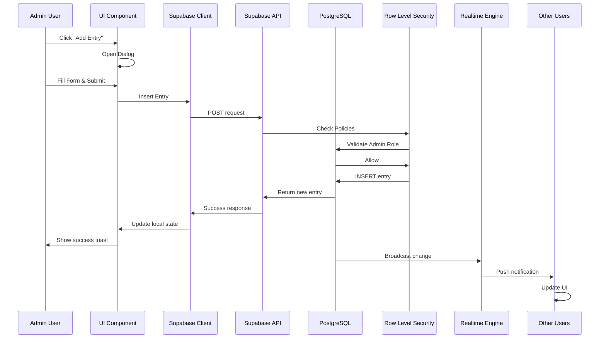
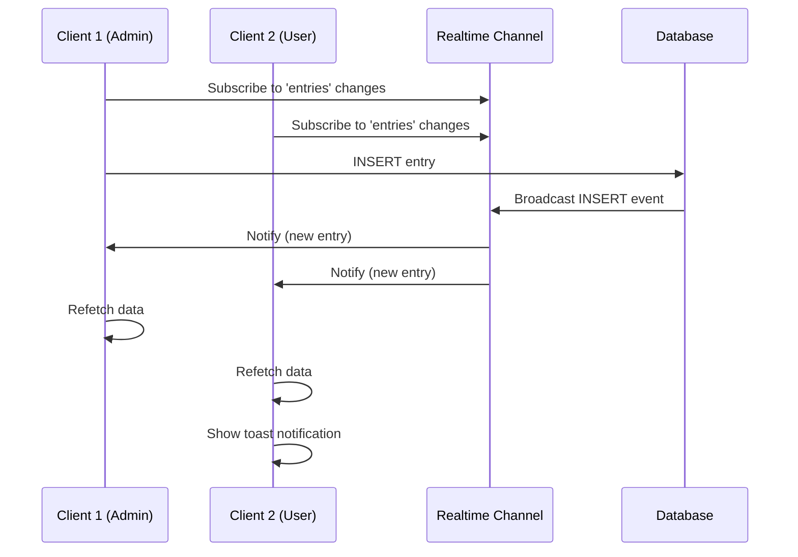

# Architecture Documentation

## Overview

ALPHV ColorShapes is built using a modern, scalable architecture that separates concerns between frontend, backend, and data layers. This document provides an in-depth look at the technical architecture and design decisions.

---

## System Architecture

### High-Level Architecture

```
┌──────────────────────────────────────────────────────────────┐
│                         CLIENT TIER                           │
│                                                               │
│  ┌────────────────────────────────────────────────────────┐ │
│  │              Next.js 15 Frontend                        │ │
│  │  ┌──────────────┐  ┌──────────────┐  ┌─────────────┐ │ │
│  │  │  Server      │  │   Client     │  │   Static    │ │ │
│  │  │  Components  │  │  Components  │  │   Assets    │ │ │
│  │  └──────────────┘  └──────────────┘  └─────────────┘ │ │
│  └────────────────────────────────────────────────────────┘ │
│                            │                                  │
│                            │ HTTPS                            │
└────────────────────────────┼──────────────────────────────────┘
                             │
┌────────────────────────────┼──────────────────────────────────┐
│                            │                                  │
│                  ┌─────────▼────────┐                        │
│                  │  Supabase SDK    │                        │
│                  │  (Client Layer)  │                        │
│                  └─────────┬────────┘                        │
│                            │                                  │
│                         API Calls                             │
│                      (REST + WS)                              │
│                            │                                  │
│  ┌─────────────────────────┼─────────────────────────────┐  │
│  │              BACKEND-AS-A-SERVICE (Supabase)           │  │
│  │                         │                              │  │
│  │  ┌──────────────────┐   │   ┌────────────────────┐   │  │
│  │  │  Auth Service    │◄──┼──►│  PostgreSQL DB     │   │  │
│  │  │  (GoTrue)        │   │   │  + Extensions      │   │  │
│  │  └──────────────────┘   │   └────────────────────┘   │  │
│  │                         │                              │  │
│  │  ┌──────────────────┐   │   ┌────────────────────┐   │  │
│  │  │  Realtime Engine │◄──┼──►│  Row Level Security│   │  │
│  │  │  (WebSockets)    │   │   │  (RLS Policies)    │   │  │
│  │  └──────────────────┘   │   └────────────────────┘   │  │
│  │                         │                              │  │
│  │  ┌──────────────────┐   │   ┌────────────────────┐   │  │
│  │  │  PostgREST API   │◄──┼──►│  Storage (Future)  │   │  │
│  │  │  (Auto-generated)│       └────────────────────┘   │  │
│  │  └──────────────────┘                                 │  │
│  └────────────────────────────────────────────────────────┘  │
│                       DATA TIER                               │
└───────────────────────────────────────────────────────────────┘
```

---

## Component Architecture

### Next.js App Router Structure

```
app/
├── (public routes)
│   ├── login/              # Unauthenticated users
│   └── auth/callback/      # OAuth handler
│
├── (protected routes)
│   ├── admin/              # Role: admin
│   │   ├── layout.tsx      # Auth + Role Guard
│   │   └── page.tsx        # Admin Dashboard
│   │
│   └── user/               # Role: user
│       ├── layout.tsx      # Auth Guard
│       └── page.tsx        # User Dashboard
│
└── api/
    └── auth/signout/       # API route for logout
```

### Component Hierarchy

```
Root Layout (app/layout.tsx)
│
├── Server Components (RSC)
│   ├── Admin Layout (admin/layout.tsx)
│   │   └── Admin Page (admin/page.tsx)
│   │       └── Initial Data Fetch
│   │
│   ├── User Layout (user/layout.tsx)
│   │   └── User Page (user/page.tsx)
│   │       └── Initial Data Fetch
│   │
│   └── Login Page (login/page.tsx)
│
└── Client Components ('use client')
    ├── EntriesTable
    │   ├── Realtime Subscription
    │   ├── Table Rows
    │   └── Action Buttons (admin only)
    │
    ├── EntryDialog
    │   ├── Form State
    │   ├── Validation
    │   └── Submit Handler
    │
    ├── ShapesChart
    │   ├── Data Processing
    │   └── Recharts Integration
    │
    └── UI Components
        ├── Button
        ├── Dialog
        ├── Input
        └── ... (Radix UI)
```

---

## Data Flow

### Authentication Flow



### CRUD Operation Flow (Admin)



### Realtime Sync Flow



---

## Database Design

### Entity Relationship Diagram

```
┌─────────────────────┐
│     auth.users      │
│ ─────────────────── │
│ id (PK)       UUID  │
│ email         TEXT  │
│ created_at    TIMESTAMP  │
└──────────┬──────────┘
           │ 1
           │
           │ 1:1
           │
┌──────────▼──────────┐
│   public.profiles   │
│ ─────────────────── │
│ id (PK,FK)    UUID  │ ───► References auth.users(id)
│ role          TEXT  │      DEFAULT 'user'
│ created_at    TIMESTAMP  │
└──────────┬──────────┘
           │ 1
           │
           │ 1:N
           │
┌──────────▼──────────┐
│   public.entries    │
│ ─────────────────── │
│ id (PK)       UUID  │
│ name          TEXT  │
│ shape         TEXT  │
│ color         TEXT  │
│ created_by(FK)UUID  │ ───► References auth.users(id)
│ created_at    TIMESTAMP  │
└─────────────────────┘
```

### Row Level Security (RLS) Flow

```
User Request
     │
     ▼
┌─────────────────┐
│  Check JWT      │  Is user authenticated?
└────────┬────────┘
         │ Yes
         ▼
┌─────────────────┐
│  RLS Policies   │  Which policy applies?
└────────┬────────┘
         │
    ┌────┴────┐
    │         │
    ▼         ▼
  SELECT    INSERT/UPDATE/DELETE
    │         │
    │         ▼
    │    ┌──────────────┐
    │    │ Check Role   │  Is user admin?
    │    └──────┬───────┘
    │           │ Yes
    │           ▼
    │    ┌──────────────┐
    │    │ Execute Query│
    │    └──────────────┘
    │           │
    └───────────┴─────► Return Results
```

### RLS Policy Details

#### Profiles Table

```sql
-- Policy 1: Users can read their own profile
CREATE POLICY "Users can read own profile"
  ON profiles FOR SELECT
  USING (auth.uid() = id);

-- Policy 2: Users can update their own profile
CREATE POLICY "Users can update own profile"
  ON profiles FOR UPDATE
  USING (auth.uid() = id);
```

#### Entries Table

```sql
-- Policy 1: All authenticated users can read entries
CREATE POLICY "All users can read entries"
  ON entries FOR SELECT
  TO authenticated
  USING (true);

-- Policy 2: Only admins can insert entries
CREATE POLICY "Only admins can insert entries"
  ON entries FOR INSERT
  TO authenticated
  WITH CHECK (
    EXISTS (
      SELECT 1 FROM profiles
      WHERE profiles.id = auth.uid()
      AND profiles.role = 'admin'
    )
  );

-- Policy 3: Only admins can update entries
CREATE POLICY "Only admins can update entries"
  ON entries FOR UPDATE
  TO authenticated
  USING (
    EXISTS (
      SELECT 1 FROM profiles
      WHERE profiles.id = auth.uid()
      AND profiles.role = 'admin'
    )
  );

-- Policy 4: Only admins can delete entries
CREATE POLICY "Only admins can delete entries"
  ON entries FOR DELETE
  TO authenticated
  USING (
    EXISTS (
      SELECT 1 FROM profiles
      WHERE profiles.id = auth.uid()
      AND profiles.role = 'admin'
    )
  );
```

---

## Frontend Architecture

### Server Components vs Client Components

#### When to Use Server Components

✅ **Use Server Components for:**
- Initial data fetching
- Database queries
- API calls to external services
- Authentication checks
- Layout/page shells
- Static content

**Benefits:**
- No JavaScript sent to client
- Direct database access
- Better SEO
- Faster initial page load
- Reduced bundle size

**Example:**
```typescript
// app/admin/page.tsx (Server Component)
export default async function AdminPage() {
  const supabase = await createServerSupabaseClient()
  const { data: entries } = await supabase
    .from('entries')
    .select('*')
    .order('created_at', { ascending: false })
  
  return <EntriesTable entries={entries} />
}
```

#### When to Use Client Components

✅ **Use Client Components for:**
- Interactivity (onClick, onChange)
- React hooks (useState, useEffect, etc.)
- Browser APIs (window, document)
- Realtime subscriptions
- Form state management
- Animations

**Example:**
```typescript
// components/entries-table.tsx (Client Component)
'use client'

export function EntriesTable({ entries }) {
  const [data, setData] = useState(entries)
  
  useEffect(() => {
    // Realtime subscription
    const channel = supabase.channel('entries')
    // ...
  }, [])
  
  return <table>...</table>
}
```

### State Management Strategy

```
┌─────────────────────────────────────┐
│        Server Components            │
│  (Initial Data + Auth Checks)       │
└──────────────┬──────────────────────┘
               │
               │ Props
               ▼
┌─────────────────────────────────────┐
│        Client Components            │
│                                     │
│  ┌───────────────────────────────┐ │
│  │  Local State (useState)       │ │
│  │  - Optimistic updates         │ │
│  │  - Form state                 │ │
│  │  - UI state                   │ │
│  └───────────────────────────────┘ │
│                                     │
│  ┌───────────────────────────────┐ │
│  │  Realtime Subscriptions       │ │
│  │  - Sync with database         │ │
│  │  - Update local state         │ │
│  └───────────────────────────────┘ │
│                                     │
│  ┌───────────────────────────────┐ │
│  │  Context (if needed)          │ │
│  │  - Global theme               │ │
│  │  - User preferences           │ │
│  └───────────────────────────────┘ │
└─────────────────────────────────────┘
```

---

## API Architecture

### Supabase Client Configuration

#### Browser Client (Client Components)

```typescript
// lib/supabase.ts
import { createBrowserClient } from '@supabase/ssr'

export function createClientSupabaseClient() {
  return createBrowserClient(
    process.env.NEXT_PUBLIC_SUPABASE_URL!,
    process.env.NEXT_PUBLIC_SUPABASE_ANON_KEY!
  )
}
```

**Used for:**
- Client-side data mutations
- Realtime subscriptions
- Client-side queries in hooks

#### Server Client (Server Components)

```typescript
// lib/supabase-server.ts
import { createServerClient } from '@supabase/ssr'
import { cookies } from 'next/headers'

export async function createServerSupabaseClient() {
  const cookieStore = await cookies()
  
  return createServerClient(
    process.env.NEXT_PUBLIC_SUPABASE_URL!,
    process.env.NEXT_PUBLIC_SUPABASE_ANON_KEY!,
    {
      cookies: {
        get(name: string) {
          return cookieStore.get(name)?.value
        },
      },
    }
  )
}
```

**Used for:**
- Server-side data fetching
- Authentication checks
- Initial page loads
- API routes

---

## Security Architecture

### Security Layers

```
┌─────────────────────────────────────────────┐
│         Layer 1: Network Security           │
│  - HTTPS/TLS encryption                     │
│  - CORS policies                            │
│  - Rate limiting                            │
└──────────────────┬──────────────────────────┘
                   │
┌──────────────────▼──────────────────────────┐
│      Layer 2: Authentication                │
│  - JWT token validation                     │
│  - Session management (HTTP-only cookies)   │
│  - OAuth 2.0 with Google                    │
└──────────────────┬──────────────────────────┘
                   │
┌──────────────────▼──────────────────────────┐
│      Layer 3: Authorization                 │
│  - Role-Based Access Control (RBAC)         │
│  - Layout guards (server-side)              │
│  - RLS policies (database-level)            │
└──────────────────┬──────────────────────────┘
                   │
┌──────────────────▼──────────────────────────┐
│      Layer 4: Data Validation               │
│  - TypeScript type checking                 │
│  - Form validation (client + server)        │
│  - SQL injection prevention (Supabase)      │
│  - XSS prevention (React auto-escape)       │
└─────────────────────────────────────────────┘
```

### Authentication Security

```typescript
// Session stored in HTTP-only cookie
// ✅ Protected from JavaScript access
// ✅ Protected from XSS attacks
// ✅ Automatically sent with requests

const supabase = createServerClient(url, key, {
  cookies: {
    get(name) { return cookieStore.get(name)?.value },
    set(name, value, options) {
      cookieStore.set({
        name,
        value,
        httpOnly: true,  // ← Can't be accessed by JavaScript
        secure: true,    // ← Only sent over HTTPS
        sameSite: 'lax', // ← CSRF protection
        ...options
      })
    },
  },
})
```

---

## Performance Optimizations

### 1. Server Components for Initial Render

- Zero JavaScript for static content
- Faster Time to First Byte (TTFB)
- Better Core Web Vitals

### 2. Code Splitting

```
Admin Dashboard
  ├── Common Components (shared)
  ├── Admin-specific Code (lazy loaded)
  └── Charts (dynamic import)

User Dashboard
  ├── Common Components (shared)
  ├── User-specific Code (lazy loaded)
  └── Charts (dynamic import)
```

### 3. Database Query Optimization

```typescript
// ✅ Good: Select only needed columns
const { data } = await supabase
  .from('entries')
  .select('id, name, shape, color, created_at')
  .order('created_at', { ascending: false })

// ❌ Bad: Select all columns
const { data } = await supabase
  .from('entries')
  .select('*')
```

### 4. Realtime Optimization

```typescript
// Only subscribe to necessary events
const channel = supabase
  .channel('entries-changes')
  .on('postgres_changes', {
    event: '*',           // INSERT, UPDATE, DELETE
    schema: 'public',
    table: 'entries'
  }, handleChange)
  .subscribe()

// Cleanup on unmount to prevent memory leaks
return () => { channel.unsubscribe() }
```

### 5. Image Optimization

- Next.js Image component for automatic optimization
- WebP format with fallbacks
- Lazy loading for offscreen images
- Responsive images with srcset

---

## Scalability Considerations

### Horizontal Scaling

```
┌──────────────────────────────────────┐
│        Load Balancer (Vercel)        │
└──────────┬───────────┬───────────────┘
           │           │
    ┌──────▼──┐   ┌───▼──────┐
    │  Edge   │   │  Edge    │   (Multiple edge locations)
    │ Server  │   │ Server   │
    └──────┬──┘   └───┬──────┘
           │          │
           └────┬─────┘
                │
        ┌───────▼────────┐
        │    Supabase    │
        │   (Managed)    │
        └────────────────┘
```

### Database Scaling

- **Connection Pooling**: Supabase handles automatically
- **Read Replicas**: Available in Supabase Pro
- **Caching**: Consider adding Redis for session storage
- **Indexing**: Add indexes on frequently queried columns

```sql
-- Add indexes for performance
CREATE INDEX idx_entries_created_at ON entries(created_at);
CREATE INDEX idx_entries_created_by ON entries(created_by);
CREATE INDEX idx_profiles_role ON profiles(role);
```

---

## Monitoring & Observability

### Key Metrics to Track

1. **Frontend Metrics**
   - Time to First Byte (TTFB)
   - First Contentful Paint (FCP)
   - Largest Contentful Paint (LCP)
   - Cumulative Layout Shift (CLS)
   - Total Blocking Time (TBT)

2. **Backend Metrics**
   - API response times
   - Database query performance
   - Error rates
   - Realtime connection count

3. **Business Metrics**
   - Active users (admin vs user)
   - Entries created per day
   - Average session duration
   - Feature usage

### Logging Strategy

```typescript
// Error logging
try {
  await supabase.from('entries').insert(data)
} catch (error) {
  console.error('Failed to insert entry:', {
    error,
    userId: user.id,
    timestamp: new Date().toISOString(),
  })
  // Send to error tracking service (e.g., Sentry)
}
```

---

## Future Architecture Enhancements

### 1. Caching Layer

```
Frontend → Cache (Redis) → Supabase
                ↓
           Realtime invalidation
```

### 2. Background Jobs

```typescript
// Queue system for heavy operations
import { Queue } from 'bullmq'

const exportQueue = new Queue('export-data')

exportQueue.add('export', {
  userId: user.id,
  format: 'csv',
})
```

### 3. Microservices (if needed)

```
┌─────────────┐   ┌─────────────┐   ┌─────────────┐
│   Main App  │   │  Analytics  │   │   Export    │
│   (Next.js) │   │   Service   │   │   Service   │
└──────┬──────┘   └──────┬──────┘   └──────┬──────┘
       │                 │                  │
       └─────────────────┴──────────────────┘
                         │
                    Event Bus
                    (Message Queue)
```

### 4. GraphQL Layer

```typescript
// Instead of REST API
// Use GraphQL for complex queries

query GetDashboard {
  user {
    id
    profile {
      role
    }
    entries {
      id
      name
      shape
      color
    }
  }
}
```

---

## Technology Decisions

### Why Next.js?

✅ **Server Components** - Better performance & SEO  
✅ **App Router** - Modern routing with layouts  
✅ **TypeScript** - Built-in support  
✅ **API Routes** - Full-stack in one framework  
✅ **Vercel Deployment** - Zero-config deployment  

### Why Supabase?

✅ **PostgreSQL** - Mature, reliable database  
✅ **Realtime** - Built-in WebSocket support  
✅ **Auth** - OAuth providers included  
✅ **RLS** - Database-level security  
✅ **Auto-generated API** - No backend code needed  

### Why Tailwind CSS?

✅ **Utility-first** - Rapid development  
✅ **Small bundle** - Unused styles purged  
✅ **Consistency** - Design system built-in  
✅ **Responsive** - Mobile-first by default  

### Why Radix UI?

✅ **Accessible** - WCAG 2.1 compliant  
✅ **Unstyled** - Full styling control  
✅ **Composable** - Build custom components  
✅ **Keyboard Navigation** - Built-in support  

---

## Conclusion

This architecture provides a solid foundation for a scalable, secure, and maintainable application. The combination of Next.js 15 Server Components, Supabase, and modern React patterns ensures optimal performance and developer experience.

For questions or clarifications, refer to the main README or contact the development team.
